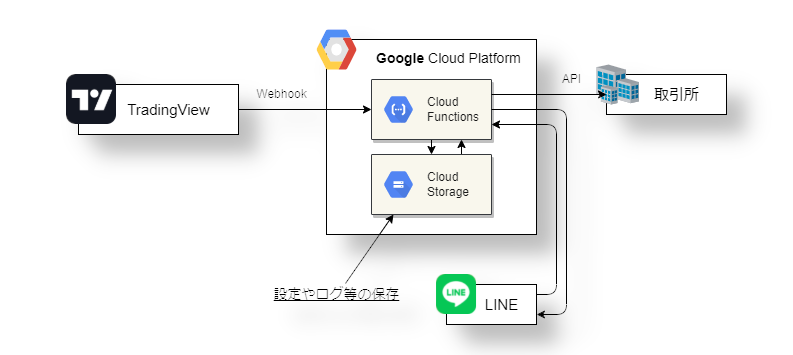

# gcp-cryptocurrency-trading


# 特徴
+ トレーディングビューのストラテジーが使える。
+ LINEで仮想通貨取引の設定・確認ができる。
+ 無料

# コマンド一覧
## 初期化
```Bash
gcloud init
```

## Cloud Storage Bucket の作成
```Bash
gsutil mb -b on -l us-central1 --pap enforced gs://bucket_name
```

## Cloud Functions のデプロイ
```Bash
gcloud functions deploy order --runtime python39 --trigger-http --allow-unauthenticated
gcloud functions deploy line_bot --runtime python39 --trigger-http --allow-unauthenticated
gcloud functions deploy history --runtime python39 --trigger-http --allow-unauthenticated
```

## Test
```Bash
curl -X POST "https://us-central1-XXXXX.cloudfunctions.net/order" -H "Content-Type:text/plain" --data "test_bot1 buy"
curl -X POST "https://us-central1-XXXXX.cloudfunctions.net/order" -H "Content-Type:text/plain" --data "test_bot1 sell"
curl -X POST "https://us-central1-XXXXX.cloudfunctions.net/order" -H "Content-Type:text/plain" --data "test_bot1 close_all"
curl -X POST "https://us-central1-XXXXX.cloudfunctions.net/order" -H "Content-Type:text/plain" --data "test_bot1 close_long"
curl -X POST "https://us-central1-XXXXX.cloudfunctions.net/order" -H "Content-Type:text/plain" --data "test_bot1 close_short"
```
